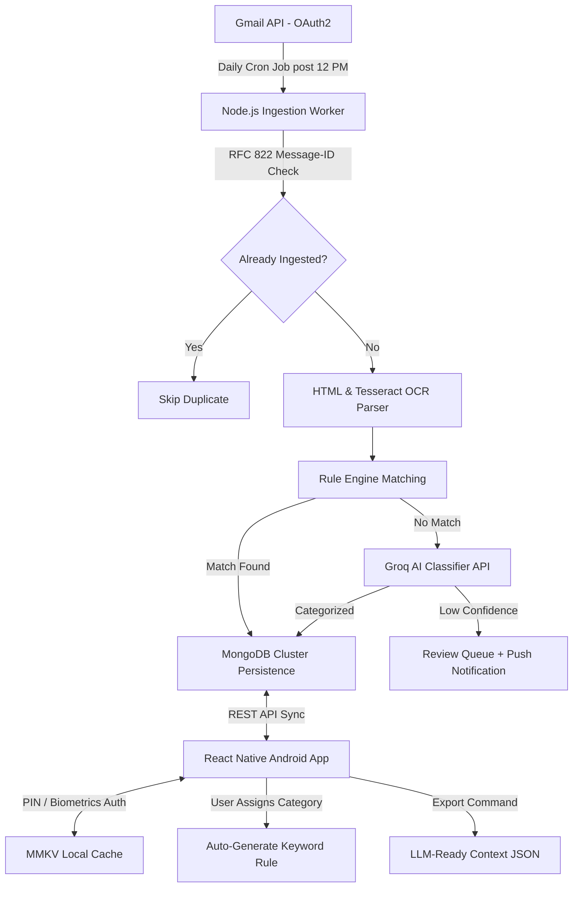

# Lekka - Offline-First Smart Email Management & Automation Engine

Lekka is an Android-focused application built with React Native (TypeScript), Node.js, MongoDB Cluster, Groq AI, and MMKV local storage. It automates targeted email ingestion daily post-12:00 PM via Gmail API, extracts structured payloads from HTML and image attachments, classifies messages using a hybrid rule engine and Groq AI, and caches data locally on device for offline availability and LLM export.

---

## System Architecture



---

## Core Features

* **Automated Scheduled Ingestion**: Executes background email fetching daily post 12:00 PM local time filtered by target senders.
* **Header Message-ID Deduplication**: Guarantees zero duplicate processing using MongoDB unique indexes on RFC 822 Message-ID headers.
* **Multi-Stage Content Parsing**: Extracts clean text, key-value items (invoices, amounts, reference numbers, dates) from HTML and image attachments using Tesseract OCR.
* **Hybrid Classification Cascade**: Evaluates database keyword/regex rules first, falling back to Groq AI LLM inference.
* **Feedback Learning Loop**: Automatically generates new matching rules in MongoDB whenever a user re-assigns or confirms a category.
* **On-Device Security**: Protects local MMKV cached data using PIN code and Biometric fingerprint authorization.
* **Analytics & Financial Dashboard**: Aggregates financial totals, monthly volume trends, category breakdowns, and AI accuracy metrics.
* **Visual Rule Builder**: Drag-and-drop / condition builder allowing users to create custom pattern matching rules.
* **LLM-Ready Context Exporter**: Produces a self-contained, structured JSON bundle containing categorization history, lineage logs, and parsed payloads ready for external LLMs.

---

## Technology Stack

| Layer | Technology | Purpose |
| :--- | :--- | :--- |
| Mobile Frontend | React Native / Vite (TypeScript) | Android mobile application interface |
| Security | PIN & Biometric Authorization | Device-level data encryption & lock |
| Local Mobile Storage | MMKV Key-Value Cache | High-performance offline data caching |
| Backend Service | Node.js (TypeScript + Express) | API server, ingestion worker, and parser pipeline |
| Primary Database | MongoDB Cluster | Document persistence for emails, categories, and rules |
| AI Classification | Groq API (llama-3.1-8b) | Ultra-low latency fallback categorization |
| OCR Parser | Tesseract.js | Text extraction from invoice and receipt image attachments |
| Scheduler | `node-cron` | Execution trigger for daily post-12 PM sync |
| Containerization | Docker & Docker Compose | Containerized service deployment |

---

## Repository Structure

```
Lekka/
├── backend/
│   ├── src/
│   │   ├── controllers/      # Express API controllers (emails, categories, rules, analytics, export)
│   │   ├── models/           # Mongoose schemas (Email, Category, Rule, Sender)
│   │   ├── routes/           # REST router configurations
│   │   ├── services/         # Gmail, Groq AI, Parser, Rule Engine, Cron, Export
│   │   ├── server.ts         # Main server entry & seed initializer
│   │   └── testApi.ts        # Integration test runner
│   ├── Dockerfile            # Multi-stage Docker container for Node.js + Tesseract OCR
│   └── package.json
├── app/
│   ├── src/
│   │   ├── App.tsx           # React app with PIN lock, category tabs, dashboard, rule builder
│   │   ├── index.css         # Glassmorphism dark mode CSS design system
│   │   └── types.ts          # Frontend TypeScript interfaces
│   ├── Dockerfile            # Multi-stage Docker container served via Nginx
│   └── package.json
├── docker-compose.yml        # Orchestration for MongoDB, backend, and app
├── plan.md                   # Product architecture specification
└── README.md                 # System documentation
```

---

## Getting Started

### Prerequisites
* Node.js v20+ installed locally
* MongoDB instance running locally on `mongodb://localhost:27017` OR Docker & Docker Compose installed

### Option A: Local Development Setup

1. **Configure Environment Variables**:
   Update `backend/.env` with your credentials:
   ```env
   PORT=5000
   MONGODB_URI=mongodb://localhost:27017/lekka_db
   GROQ_API_KEY=your_groq_api_key
   GMAIL_CLIENT_ID=your_gmail_client_id
   GMAIL_CLIENT_SECRET=your_gmail_client_secret
   GMAIL_REFRESH_TOKEN=your_gmail_refresh_token
   TARGET_SENDER_EMAILS=invoices@company.com,billing@vendor.com
   INGESTION_CRON_SCHEDULE=0 12 * * *
   ```

2. **Start Backend Service**:
   ```bash
   cd backend
   npm install
   npm run dev
   ```

3. **Start Mobile Web Application**:
   ```bash
   cd app
   npm install
   npm run dev
   ```

### Option B: Docker Compose Deployment

Run the complete stack (MongoDB 7, Backend Service, and Frontend Application) in isolated containers:

```bash
docker-compose up --build
```

Access points:
* **Frontend Application**: `http://localhost:3000`
* **Backend REST API**: `http://localhost:5000`
* **MongoDB Database**: `localhost:27017`

---

## API Endpoints Reference

| Method | Path | Description |
| :--- | :--- | :--- |
| `GET` | `/health` | System health check and uptime status |
| `GET` | `/api/emails` | Fetch emails with optional category or search filters |
| `GET` | `/api/emails/:id` | Fetch specific email record details |
| `POST` | `/api/emails/:emailId/category` | Re-assign category and trigger auto rule generation |
| `GET` | `/api/categories` | Retrieve list of all categories |
| `POST` | `/api/categories` | Create a new category |
| `GET` | `/api/rules` | Fetch active pattern matching rules |
| `POST` | `/api/rules` | Add visual condition rule |
| `DELETE` | `/api/rules/:id` | Remove a classification rule |
| `GET` | `/api/analytics` | Retrieve financial totals, volume trends, and AI metrics |
| `POST` | `/api/ingest` | Manually trigger post-12 PM email ingestion pipeline |
| `GET` | `/api/export` | Download self-contained LLM-ready JSON context bundle |
