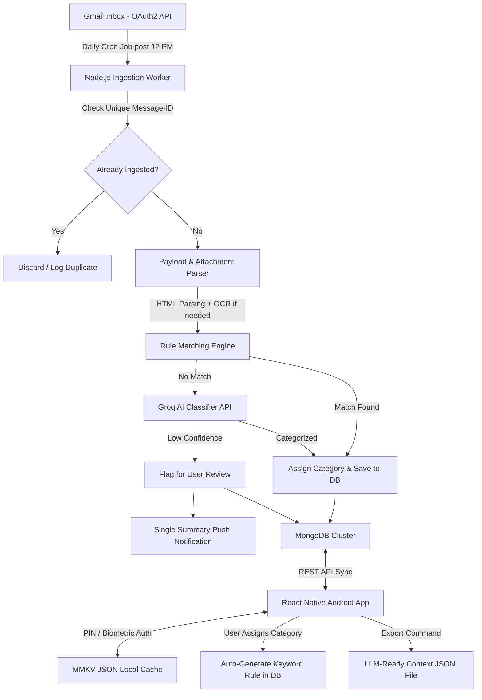

# Lekka - Comprehensive Technical Architecture & Product Blueprint

## Executive Summary
Lekka is an offline-first Android application built with React Native (TypeScript), Node.js (TypeScript backend), MongoDB Cluster, Groq AI, and MMKV local storage. It automatically ingests targeted emails from multiple senders daily post-12:00 PM via Gmail API, extracts structured payloads, classifies messages via rule-based matching and Groq AI, and synchronizes JSON representations seamlessly for offline availability and LLM export.

---

## Complete System Architecture

---

## Detailed Specifications

### 1. Ingestion & Deduplication Pipeline
* **Target Provider**: Gmail / Google Workspace via OAuth2 API integration.
* **Target Configuration**: Multi-sender support (allows registering multiple sender addresses per user).
* **Execution Trigger**: Internal `node-cron` scheduler running on backend after 12:00 PM local time.
* **Deduplication Engine**: Unique check on RFC 822 `Message-ID` header against MongoDB indexes prior to parsing.

### 2. Multi-Stage Payload Parsing
* **HTML Body Extraction**: HTML clean-up, DOM parsing, and key-value extraction.
* **Attachment OCR & AI Fallback**: Reads HTML/Text first, applies lightweight OCR for invoice/receipt images if present, and invokes Groq API for unstructured content.
* **Structured Payload Storage**: Converts parsed emails into clean, standardized JSON structures prior to persistence. Raw email blobs are excluded from local mobile storage to optimize performance.

### 3. Intelligence & Categorization Engine
* **AI Provider**: Groq API (ultra-low latency LLM inference).
* **Matching Cascade**:
  1. MongoDB Stored Keyword & Regex Rules.
  2. Groq AI Inference.
  3. Provisional candidate categorization for low-confidence results, sent to User Review Queue.
* **Feedback Learning Loop**: When a user confirms or re-assigns a category in the mobile app, the backend automatically extracts distinguishing keywords and creates a new rule in MongoDB.

### 4. Android Mobile Application Architecture
* **Framework**: React Native with TypeScript (APK target for Android).
* **Security & Authentication**: On-device PIN Code and Biometric Fingerprint authentication.
* **Feed UI Layout**: Tabbed Navigation organized by Category (e.g., Invoices, Alerts, Orders, Custom).
* **Local Storage Strategy**: Structured JSON storage in MMKV for instant offline access to DB-processed records.
* **Push Notifications**: Single consolidated summary notification sent post-12 PM when new items or reviews are added.

### 5. Extended Features Specs

#### Visual Rule Builder
Simple visual condition builder allowing users to create custom categorization rules:
* Condition Options: `Sender contains X`, `Subject contains Y`, `Text includes Z`.
* Action: Assign to Category `C` with priority weight.

#### Analytics & Insights Dashboard
* Category Breakdown Pie Charts.
* Monthly Ingestion & Transaction Volume Trends.
* AI vs User Categorization Accuracy Metrics.
* System Ingestion Timeline Logs & Unreviewed Item Counters.

#### LLM-Ready JSON Export System
Exports a self-contained, structured JSON file saved locally to device storage containing:
* Complete Email Metadata & Parsed Key-Value Payload.
* Categorization History (Rule ID, Groq AI raw response, User edits).
* Temporal Context & Lineage Logs (ready for direct input into external LLMs).

---

## Technical Stack Matrix

| Component | Selected Solution | Role / Description |
| :--- | :--- | :--- |
| Mobile App Framework | React Native (TypeScript) | Android APK UI application |
| Security | Biometrics / PIN Lock | Device-level authorization |
| Local Storage | MMKV Storage | Ultra-fast JSON key-value store |
| Backend Server | Node.js (TypeScript) | API, parsing pipeline, and scheduler |
| Automation Scheduler | `node-cron` | Execution trigger for daily post-12 PM sync |
| Database | MongoDB Cluster | Primary persistent database |
| AI Classification | Groq API | High-speed LLM categorization fallback |
| Push Notifications | Firebase Cloud Messaging (FCM) | Consolidated summary notification service |
| Email Protocol | Gmail API (OAuth2) | Email fetching & header verification |

---

## Complete Database Schemas

### `senders` Collection
| Field | Type | Description |
| :--- | :--- | :--- |
| `_id` | ObjectId | Sender identifier |
| `emailAddress` | String | Target sender email address |
| `displayName` | String | Sender name tag |
| `isActive` | Boolean | Target monitoring flag |

### `emails` Collection
| Field | Type | Description |
| :--- | :--- | :--- |
| `_id` | ObjectId | Primary key |
| `messageId` | String | Unique RFC 822 Email Header Message-ID |
| `senderId` | ObjectId | Reference to `senders` |
| `subject` | String | Email subject |
| `parsedJson` | Object | Clean JSON payload extracted from body/attachments |
| `hasAttachments` | Boolean | True if attachments were processed |
| `ocrExtractedText` | String | Extracted OCR text if image attachment parsed |
| `categoryId` | ObjectId | Assigned category reference |
| `categorySource` | Enum | Origin (`RULE`, `GROQ_AI`, `USER_MANUAL`) |
| `aiConfidenceScore` | Number | Confidence score returned by Groq AI |
| `needsUserReview` | Boolean | True if provisional candidate |
| `receivedAt` | Date | Email dispatch timestamp |
| `processedAt` | Date | Backend ingestion timestamp |

### `categories` Collection
| Field | Type | Description |
| :--- | :--- | :--- |
| `_id` | ObjectId | Category identifier |
| `name` | String | Category title (e.g., Invoices, Utilities) |
| `colorCode` | String | UI display color hex |
| `createdSource` | Enum | `SYSTEM` or `USER` |

### `rules` Collection
| Field | Type | Description |
| :--- | :--- | :--- |
| `_id` | ObjectId | Rule identifier |
| `categoryId` | ObjectId | Associated category |
| `conditions` | Array of Objects | Conditions: `{ field: "subject", operator: "contains", value: "Invoice" }` |
| `autoGenerated` | Boolean | True if generated from user feedback loop |
| `createdAt` | Date | Creation timestamp |